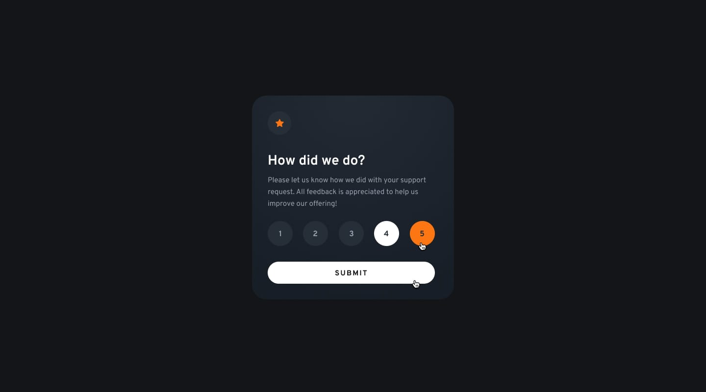

# Frontend Mentor – Interactive Rating Component Solution

This is my solution to the **Interactive Rating Component** challenge on [Frontend Mentor](https://www.frontendmentor.io/).  
The challenge helped me improve my **HTML, CSS and JavaScript skills** by building an interactive component that allows users to select a rating and see a personalized thank-you message.

## Table of Contents
- [Overview](#overview)  
- [The Challenge](#the-challenge)  
- [Design](#design)  
- [Links](#links)  
- [My Process](#my-process)  
- [Built With](#built-with)  
- [What I Learned](#what-i-learned)

## Overview
This project is an **interactive rating component**.  
Users can select a rating between 1 and 5, submit it, and see a **thank-you card** showing their selected rating.  

The interface features:
- A clean and responsive UI  
- Interactive star rating selection  
- Accessible focus, hover, and active states  
- Real-time visual feedback of selected stars  
- Smooth transition from rating selection to thank-you message  

## The Challenge
Users should be able to:

- Click or navigate via keyboard to select a rating from 1 to 5.  
- See visual feedback on hover, focus, and when a rating is selected.  
- Submit the rating only after a selection is made.  
- View a thank-you message with the rating they selected.  
- Experience a fully responsive layout across desktop and mobile screens.  
- Interact with the component using accessible focus states.  

## Design
### Desktop Design Rating

### State Hover & Active

### Thank You State

### Mobile Design

### Mobile Design Thank You State

## Links
- **Solution URL:** [GitHub Repository](https://github.com/mlopezl/my-version-of-interactive-rating-component-main-challenge)  
- **Live Site URL:** [Live Demo](https://mlopezl.github.io/my-version-of-interactive-rating-component-main-challenge/)

## My Process
1. Structured the component using **semantic HTML5**, including `<article>`, `<h1>`, `
`, `<button>` and `` for dynamic rating.  
2. Styled the component with **CSS**, applying Flexbox and Grid to center content and align elements.  
3. Defined **CSS variables** for colors and reused them throughout the component.  
4. Implemented responsive design with **media queries** for mobile devices.  
5. Added interactive states:
   - Hover and focus for buttons  
   - Active class for selected rating  
   - Disabled state for the submit button  
6. Developed **JavaScript functionality** to:
   - Handle rating selection via click and keyboard (Enter key)  
   - Dynamically update displayed stars using `createElement` and `appendChild`  
   - Toggle visibility between rating card and thank-you card  
   - Enable/disable the submit button based on user interaction  
7. Used **DOM manipulation** and `classList` methods to manage states and styles dynamically.  

## Built With
- HTML5  
- CSS3  
- Flexbox  
- CSS Grid  
- JavaScript (DOM manipulation, event handling)  

## What I Learned
- How to dynamically update the DOM using JavaScript (`createElement`, `appendChild`, `innerHTML`).  
- How to manage **interactive states** using `classList` (`add`, `remove`, `toggle`, `contains`).  
- How to handle **events** (`click`, `focusin`, `keydown`) for both mouse and keyboard users.  
- How to enable/disable buttons with `removeAttribute` and CSS `.disabled` class.  
- How to implement **accessible focus and hover states** for better UX.  
- How to structure a responsive component combining **Flexbox + Grid** efficiently.  
- How to use CSS variables and media queries to maintain design consistency and responsiveness.
